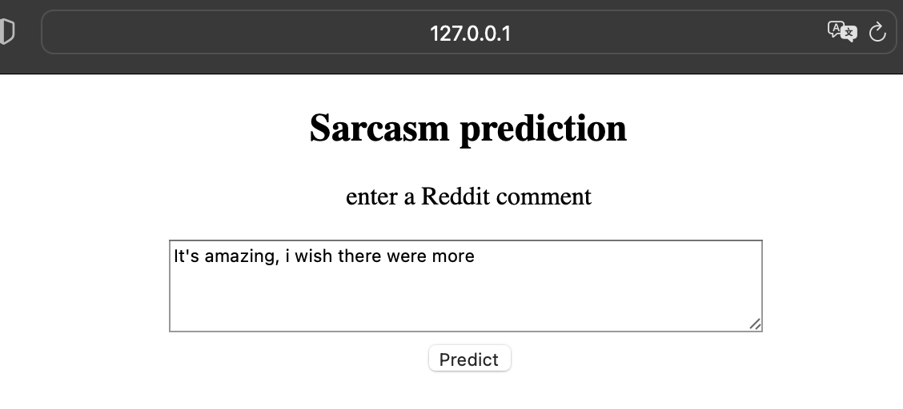
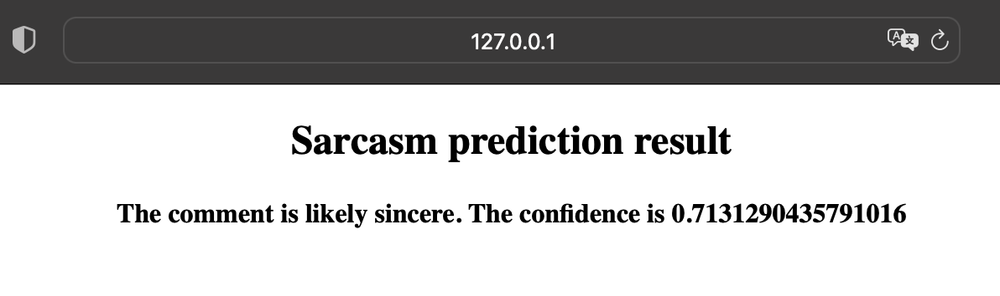
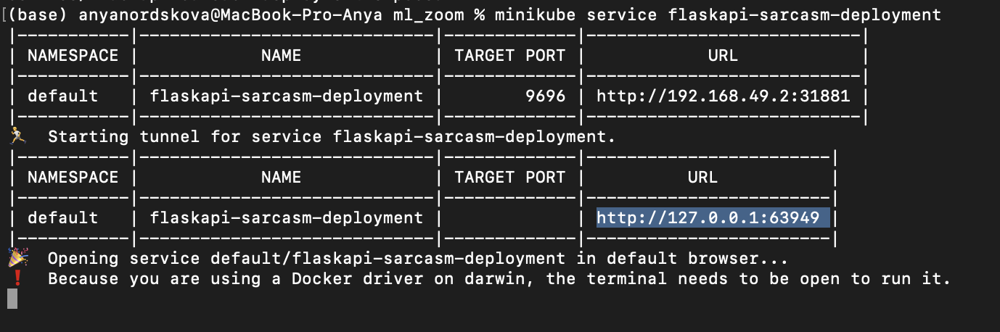

# Sarcasm detection in Reddit comments
This project has been completed as part of the ML Zoomcamp ran by [DataTalks.Club](https://datatalks.club). 

In this project we try to predict sarcasm in Reddit comments. We will work with the following balanced [Kaggle Dataset](https://www.kaggle.com/danofer/sarcasm), which is a processed version of the dataset used in the paper by
Khodak, Saunshi and Vodrahalli, entitled "A Large Self-Annotated Corpus for Sarcasm". The dataset contains more than a million Reddit comments, each labeled either sarcastic or sincere (by users themselves), along with some metadata. For more information about this dataset, follow the link above. 

## The summary of the project: 
1. **EDA.** First, we explore the data and do some preprocessing. In particular, during EDA we create several new features that look promising for future predictions. 
2. **Logistic regression and random forest**. Next, we train a simple logistic regression and a random forest classifier using tf–idf. For both we tune their hyperparameters with RandomizedSearchCV. The best accuracy score achieved by a logistic regression on the test portion of the dataset is **0.7** and for a random forest our best score was **0.68**.
3. **XGBClassifier** With the same tokenizer, next we train an XGB classifier. With default parameters it has given proximately the same accuracy score as a tuned random forest. Unfortunately, tuning our XGBclassifier either took too much resources or did not improve the score significatly. 

*These first 3 steps are contained in the notebook* **sarcasm_detection_main.ipynb**. If your browser does not render the notebooks in GitHub (e.g. for me it works fine in Google Chrome, but not in Safari), you can use [nbviewer](https://nbviewer.org/).

4. **BERT.** Finally, we fine-tune a BERT model (using bert-tiny and AutoModelForSequenceClassification). The accuracy score we achieve is **0.71**. This will be the final model used for predictions in this project. 

*The training process for this model is contained in a separate Jupyter notebook* **bert_train.ipynb**. *It is also avaliable as a python script* (**bert_train.py**).*The script generates several files which are in the subfolders "**model**" and "**tokenizer**".*

5. **Local deployment.** The model is deployed as a web service using Flask (**app.py**). To make it more user friendly, we employ *render_template* and create a simple html page (provided in the subfolders **"templates** and **static**) with a form to which you can submit your reddit comment directly in your browser. As an alernative, we have another script **predict.py** which gets its data for predictions from **test.py**. The application is containerized via Docker. Below you can see the instuctions on how to build and run the project with or without Docker. 

## How to run the project locally (without Docker): 
1. Clone the repository: 
```  git clone https://github.com/nordskova/mlzoom_midterm_proj ```
For the following steps you should be in the corresponding repository. 
2. In you haven't already, install pipenv: ``` pip install pipenv```  
If you're not sure, you can check by running ``` pipenv --version```  
3. Create a virtual environment and install all necessary packages from **Pipfile** by running  ```  pipenv install ```. 
4. Activate your virtual environment: ```  pipenv shell```. 
5. Run ``` python3 app.py``` .
6. Go to ```http://127.0.0.1:8000``` in your browser. 
7. Enter you reddit comment and predict! 




## Running the project with Docker: 
1.  Clone the repository: 
```  git clone https://github.com/nordskova/mlzoom_midterm_proj ``` For the following steps you should be in the corresponding repository. 
2. Make sure you have Docker installed: ```docker --version``` If you don't, first follow the instuctions [here](https://docs.docker.com/desktop/). Run and Docker daemon if your system doesn't do it automatically. 
3. Build a Docker image with ```docker build -t sarcasm .``` It will automatically collect all required packages and dependencies from **requirements.txt**. 
4. Now run it with ```docker run -it -p 9696:9696 sarcasm:latest``` 
5. In a new tab of the terminal/command line, run ```python3 test.py```. You will get a reply like this:  ```{'Reddit comment: ': 'Life is good!', 'Result:': 'The comment is likely sincere. The confidence is 0.7231289148330688'} ```
6. To get a new prediction, go to **test.py** and change the following line: 
 ```data = {"text": "Life is good!"}```, replacing "Life is good!" with your Reddit comment. Then run **test.py** again. 


## Cloud deployment 
The project was deployed to a local kubernetes cluster with minikube. Here we describe the process step by step. 

1. Make sure you have [homebrew](http://https://brew.sh) installed (if not, install it). 

2. Install minikube and kubectl: 

 ```brew install minikube```
 
 ```brew install kubectl```
 
3. Then run (Docker daemon should be running): 

```eval $(minikube docker-env)```

4. Now build a Docker image inside Minikube with:  

``` minikube cache add python:3.11.1``` 

```docker build -t sarcasm .```  

5. You can run ```docker images``` to make sure your image has been built successfully. 
6. Then deploy your app: 

```kubectl apply -f deploy.yaml```
7. Finally, expose it:

```kubectl expose deployment flaskapi-sarcasm-deployment --type=NodePort --port=9696```

8. Run ```minikube service flaskapi-sarcasm-deployment``` to see the information about your service. Copy the URL provided here (for me it is ```http://127.0.0.1:63949```): 



9. Go to **test.py** file. Replace ```url = 'http://localhost:9696/predict'``` with ```url = '[URL]/predict'``` (in my case ```url = 'http://127.0.0.1:63949/predict'```). 

10. In a new tab of your terminal/command line, run ```python3 test.py```. To get a new prediction for your Reddit comment, edit the variable ```text``` in **test.py** accordingly and run it again. 


## Future plans 

As I progress in learning ML and especially DL, I plan to improve the model. The first thing to do would be to add other features (which we used to train a logistic regression) to our final model, which at the moment only uses the comments themselves. Hopefully, a better accuracy/f1 score could be achieved. 

